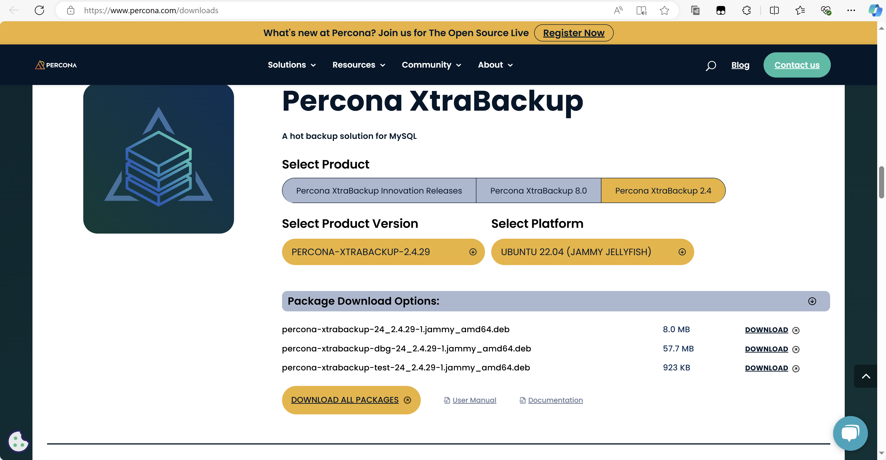

腾讯云 MySQL 数据库冷备份格式为 xb ，使用 XtraBackup 创建，恢复时也需要使用 XtraBackup ，目前还不支持 Windows 系统。本文介绍恢复过程及迁移到 Windows MySQL 中的过程。

<!-- truncate -->

### 腾讯云官方教程

[使用物理备份恢复数据库](https://cloud.tencent.com/document/product/236/33363)
里面有两点较为重要：

1. XtraBackup 只支持 Linux 平台，不支持 Windows 平台。
2. Windows 平台恢复数据请参考 [命令行工具迁移数据](https://cloud.tencent.com/document/product/236/8464)。

其实想在 Windows 平台上恢复 .XB 格式的冷备份文件也开始，我们需要在 Linux 平台上解压、恢复出数据文件，再打包拷贝至 Windows 上即可。下面是操作步骤。

### 1.安装Percona XtraBackup

安装之前需要根据 MySQL 版本选择对应的 XtraBackup 版本，MySQL 8.0 使用 XtraBackup 8，否则应该使用 XtraBackup 2.4。在 https://www.percona.com/downloads 可以选择对应的版本。

### 2.解压备份的 .xb 文件

### 3.处理解压后的 .qb 文件

### 4.打包 MySQL data 目录并复制到 Windows

### 5.在 Windows 上使用 data 目录恢复数据库
